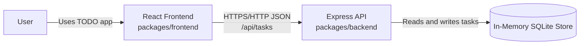
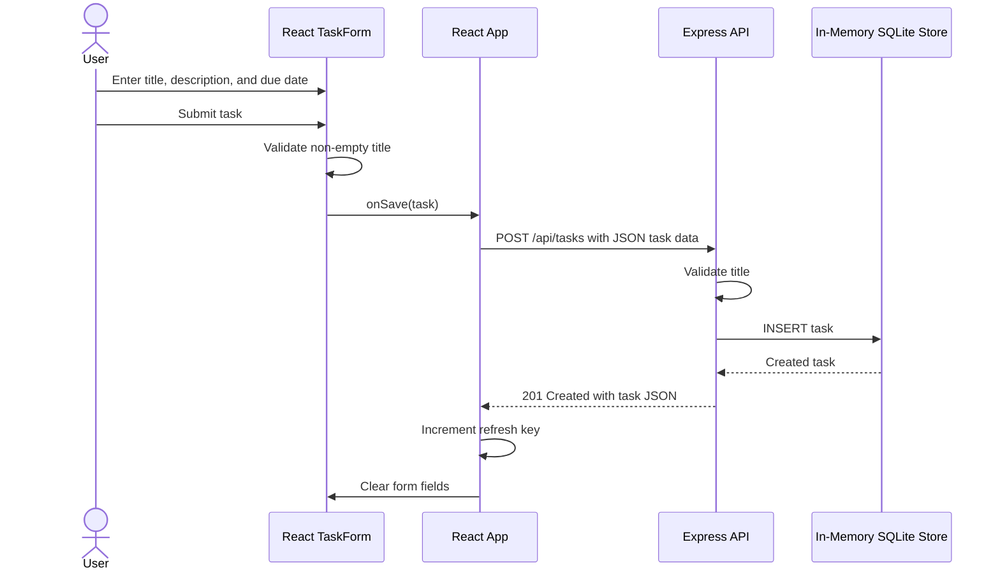

# TODO App Architecture Overview

This monorepo contains a React frontend and an Express API. The API stores task data in an in-memory SQLite database, so task data is available only for the lifetime of the running API process.

## System Context

## Create a TODO Sequence

